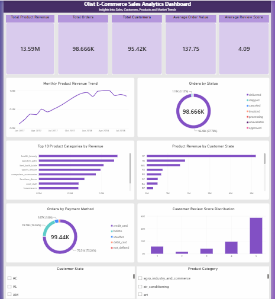

# Olist E-Commerce Analytics Project

## Power BI Dashboard




## Project Overview

This project demonstrates an end-to-end data engineering and analytics workflow using the Brazilian Olist E-Commerce dataset.

The project covers data inspection, data cleaning, PostgreSQL database loading, SQL transformations, analytics views, and an interactive Power BI dashboard.

## Architecture

Raw CSV Data
→ Python / Pandas Data Cleaning
→ Processed Data
→ PostgreSQL
→ SQL Analytics Views
→ Power BI Dashboard

## Technologies Used

- Python
- Pandas
- PostgreSQL
- SQL
- SQLAlchemy
- psycopg
- python-dotenv
- Power BI
- DAX
- Git / GitHub

## Dataset

The project uses the Brazilian Olist E-Commerce Public Dataset.

The dataset contains information about:

- Customers
- Orders
- Order Items
- Products
- Sellers
- Payments
- Reviews
- Geolocation
- Product Category Translations

Raw and processed datasets are not included in this repository due to file size considerations.

## Data Pipeline

### 1. Data Inspection

Python scripts were used to inspect:

- Dataset dimensions
- Column structures
- Missing values
- Duplicate records
- Primary and foreign key relationships

### 2. Data Cleaning

Data cleaning was performed using Python and Pandas.

Key decisions included:

- Preserving legitimate NULL values in order delivery fields
- Preserving optional review comments
- Replacing missing product categories with `unknown`
- Avoiding unnecessary deletion of geolocation records

### 3. PostgreSQL Loading

Processed CSV files were loaded into PostgreSQL using:

- Pandas
- SQLAlchemy
- psycopg

Database credentials are managed through environment variables rather than hard-coded in Python scripts.

### 4. SQL Analytics Layer

SQL views were created for analytical reporting:

- `sales_analytics`
- `payment_analytics`
- `review_analytics`

These views provide an analytics-ready layer for Power BI.

## Power BI Dashboard

The dashboard includes:

- Total Product Revenue
- Total Orders
- Total Customers
- Average Order Value
- Average Review Score
- Monthly Product Revenue Trend
- Top 10 Product Categories by Revenue
- Product Revenue by Customer State
- Orders by Status
- Orders by Payment Method
- Customer Review Score Distribution
- Interactive filters

## Data Model

An Orders table is used as a central table to connect the analytical datasets.

Relationships:

- Orders → Sales Analytics
- Orders → Payment Analytics
- Orders → Review Analytics

This structure helps avoid incorrect many-to-many relationships between analytical tables.

## Key DAX Measures

```DAX
Total Product Revenue =
SUM('public sales_analytics'[price])

Total Orders =
DISTINCTCOUNT('public sales_analytics'[order_id])

Total Customers =
DISTINCTCOUNT('public sales_analytics'[customer_unique_id])

Average Order Value =
DIVIDE(
    [Total Product Revenue],
    [Total Orders]
)